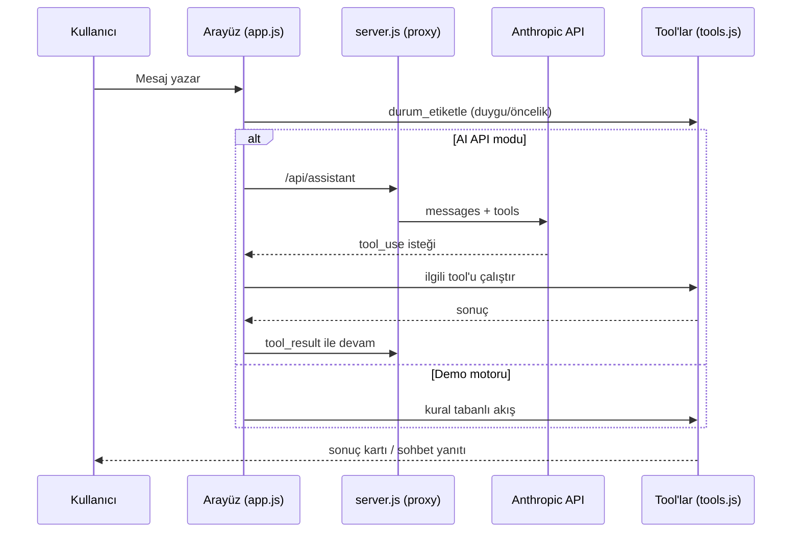

# DEPOM Müşteri Destek Agent

DEPOM adlı kurgusal e-ticaret sitesi için sipariş, kargo takip, iade ve değişim işlemlerini uçtan uca yürüten bir yapay zekâ müşteri destek agent'ı. Tool-calling mimarisi, kimlik doğrulama, dolandırıcılık/şüpheli desen tespiti ve insan temsilciye eskalasyon akışlarını canlı bir demo üzerinde gösterir.

## Özellikler

- **Sipariş & kargo takibi** — sipariş durumu, ürün, tutar, tahmini teslimat ve kargo adımları
- **İade / ürün değişimi** — süre ve teslimat kontrolü, açık kullanıcı onayı, mükerrer talep engeli
- **Kimlik doğrulama** — sipariş no + e-posta/telefon eşleşmesi olmadan hassas işlem yapılmaz
- **Duygu & öncelik analizi** — sinirli/şüpheli mesajları otomatik etiketler
- **İnsan temsilciye eskalasyon** — kalıcı vaka kuyruğu ve durum yönetimi
- **İki çalışma modu** — API gerektirmeyen Demo motoru veya gerçek Anthropic API modu
- **Sistem günlüğü** — her tool çağrısını ve sonucunu gösteren, dışa aktarılabilir log paneli
- **Koyu tema, mobil uyumlu, erişilebilir arayüz**
- **Gerçek backend modu** — imzalı oturum çerezi, dosya tabanlı kalıcı veri, sunucu taraflı yetkilendirilmiş tool uçları
- **Arayüz dil desteği** — TR/EN buton (statik arayüz metinleri; demo motorunun sohbet yanıtları hâlâ Türkçe)

## Dosyalar

| Dosya | Sorumluluk |
|---|---|
| `index.html` | Arayüz iskeleti |
| `styles.css` | Görsel stiller (açık/koyu tema, responsive) |
| `data.js` | Mock müşteri/sipariş verisi ve tarih yardımcıları (tarayıcı + Node ortak) |
| `i18n.js` | Statik arayüz metinleri için TR/EN sözlük |
| `tools.js` | Tarayıcı taraflı depolama ve agent tool implementasyonları (Demo motoru) |
| `agent.js` | Tool şemaları ve sistem promptu |
| `app.js` | UI, demo motoru, event akışları, API döngüsü |
| `server.js` | HTTP sunucusu: statik dosyalar, AI proxy, oturum/tool uçları, metrikler |
| `server/db.js` | Dosya tabanlı kalıcı veri katmanı (geçmiş, temsilci vakaları) |
| `server/session.js` | İmzalı, HttpOnly çerez tabanlı oturum yönetimi |
| `server/tools.js` | Sunucu taraflı kanonik tool implementasyonları (e-posta oturumdan alınır) |
| `server/*.test.js` | Node yerleşik test çalıştırıcısı ile birim testleri |

## Çalıştırma

### Demo motoru (kurulum gerektirmez)
`index.html` dosyasını tarayıcıda açmanız yeterli. Varsayılan mod, API gerektirmeyen kural tabanlı Demo motorudur ve tüm senaryoları (kargo sorgulama, iade, değişim, şüpheli/sinirli müşteri) baştan sona çalıştırır.

### AI API modu (gerçek Claude çağrısı)
Node.js 18+ gerekir. API anahtarı yalnızca sunucuda tutulur, tarayıcıya asla gönderilmez.

```powershell
$env:ANTHROPIC_API_KEY = "anahtarınızı-buraya-yazın"
npm start
```

Ardından `http://localhost:3000` adresini açıp üstteki moddan "AI API modu"nu seçin. Sunucu durumunu `http://localhost:3000/api/health` üzerinden kontrol edebilirsiniz.

`server.js` şunları sağlar:
- İstek başına 1 MB gövde sınırı
- IP başına dakikada 30 istekle rate limit
- CSP / `X-Frame-Options` / `X-Content-Type-Options` güvenlik başlıkları
- Anonim audit kaydı (`audit-log.jsonl`, 5 MB üzerinde otomatik rotasyon, Git'e dahil edilmez)
- `/api/metrics` üzerinden temel sayaçlar (istek, hata, rate-limit, tool çağrısı)
- Beklenmeyen istisnalarda güvenli kapanma, `SIGINT`/`SIGTERM` ile düzgün kapanış

### Gerçek backend modu (oturum + kalıcı veri)

`server.js`, tarayıcının artık iş mantığına doğrudan güvenmediği ayrı bir uç noktası da sunar:

1. `POST /api/auth/login` — `{siparis_no, contact}` ile giriş yapar, başarılıysa imzalı `HttpOnly` oturum çerezi döner.
2. `POST /api/tools/:name` — oturum zorunludur (`kimlik_dogrula` hariç); e-posta her zaman çerezden alınır, istemciden gelen değere güvenilmez.
3. `GET /api/cases`, `POST /api/cases/:id/resolve` — temsilci vaka kuyruğunu `server/db.js` üzerinden kalıcı okur/günceller.
4. `GET /api/auth/me`, `POST /api/auth/logout`.

Bu uçlar `tools.js`/`localStorage` tabanlı istemci demosunun yerini almaz; production'a geçişte istemcinin bu uçlara taşınması gereken hedef mimariyi gösterir. Oturum imzalama anahtarını sabitlemek için `SESSION_SECRET` ortam değişkenini tanımlayın (tanımlanmazsa her yeniden başlatmada rastgele üretilir ve mevcut oturumlar geçersiz olur).

### Test

Harici bağımlılık gerekmez, Node'un yerleşik test çalıştırıcısını kullanır:

```powershell
npm test
```

`server/tools.test.js` iş kurallarını (yetkisiz sipariş erişimi, süresi geçmiş iade, mükerrer talep engeli, eskalasyon) ve `server/session.test.js` oturum imzalama/doğrulamayı kapsar.

## Mimari akış



## Bilinen sınırlar

- Demo motoru (`tools.js` + `app.js`) hâlâ tarayıcı belleğinde/`localStorage`'da çalışır; bu, kurulumsuz demo deneyimi için bilinçli bir tercihtir.
- `server/db.js` küçük ölçekli, dosya tabanlı bir depolama katmanıdır; eşzamanlı yoğun yazımlarda gerçek bir veritabanının (Postgres/SQLite) yerini tutmaz.
- Demo motorunun niyet tespiti Türkçe anahtar kelimelere dayanır; `i18n.js` yalnızca statik arayüz metinlerini çevirir, sohbet yanıtlarını değil.
- `server/tools.js` ile `tools.js` iş mantığı kasıtlı olarak birbirine paralel tutulmuştur (aynı veri modülü `data.js`'i paylaşırlar); gerçek üretimde tek bir kanonik kaynağa indirgenmelidir.
- Audit kayıtları şu an yerel dosyaya yazılır; üretimde merkezi bir log/izleme sistemine yönlendirilmelidir.

Bu depo; mimariyi, tool-calling akışını ve güvenlik desenlerini göstermek amaçlı bir referans/demo projesidir.
