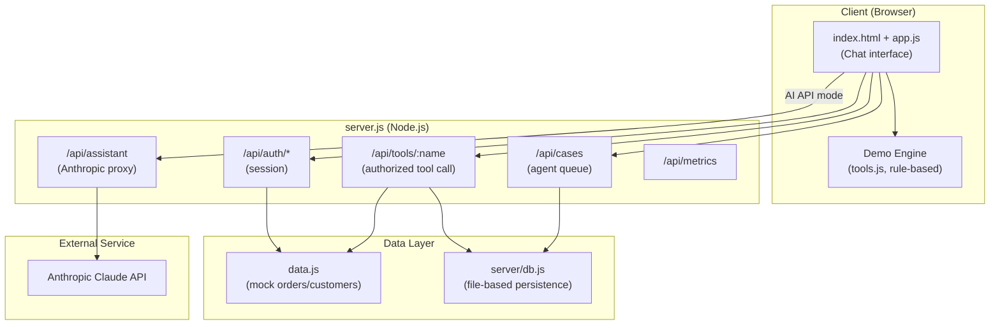
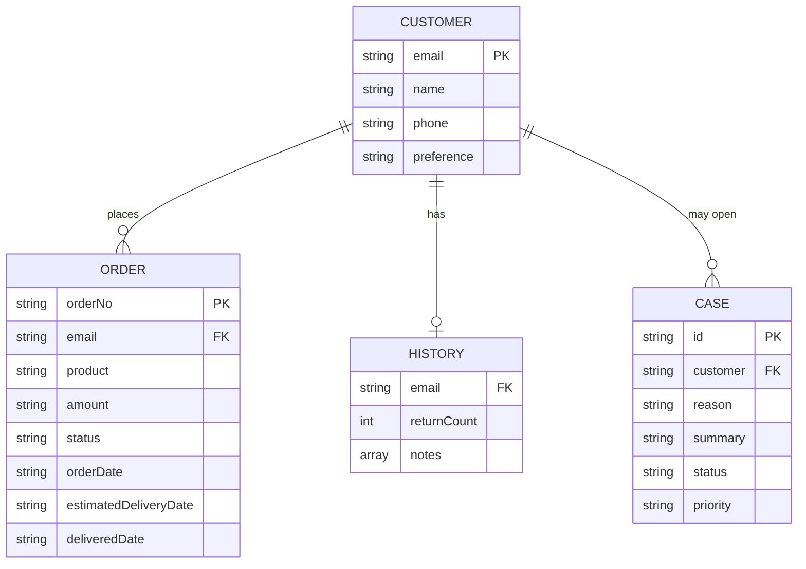

# DEPOM Customer Support Agent — Graduation Project Report (Draft)

> This document is a **skeleton** prepared to help turn this project into a university graduation project submission. Text in square brackets `[...]` must be completed by the student. The references section is intentionally left as a template — no fabricated/non-existent academic sources have been added; a real literature review should be done together with your advisor.

## Cover Page
- Project Name: DEPOM Customer Support Agent
- Student: [Full Name, Student No]
- Advisor: [Advisor Name, Title]
- Department / University: [Department, University]
- Submission Date: [Date]

## Abstract

This project presents a large language model (LLM)-based **tool-calling** customer support agent for common e-commerce support workflows: order status lookup, shipment tracking, and returns/exchanges. The system models real-world customer service requirements such as identity verification, action authorization, suspicious/fraud pattern detection, and escalation to a human representative. It ships with two operating modes: an API-free rule-based "demo engine" and an "AI API mode" that connects to a real LLM service (Anthropic Claude). The project also demonstrates production-oriented architectural patterns via a secure backend (session management, persistent data layer, rate limiting, security headers).

**Keywords:** [e.g. AI agents, tool-calling, customer support automation, LLM, web security]

## Table of Contents
1. Introduction
2. Literature Review / Related Systems
3. System Design
4. Implementation
5. Testing and Evaluation
6. Conclusion and Future Work
7. References

---

## 1. Introduction

### 1.1 Problem Statement
Traditional customer support channels consume significant human resources on repetitive, rule-driven tasks such as order status checks, shipment tracking, and returns/exchanges. While parts of this workload can be automated, full automation carries risk due to sensitivities such as identity verification, fraud exposure, and customer trust.

### 1.2 Objective and Scope
The objective of this project is to let an AI agent carry out order/shipping/return/exchange operations through an architecture that is secure, auditable, and requires explicit user confirmation before irreversible actions. Scope:
- [ ] Order lookup and shipment tracking
- [ ] Returns and product exchange (with delivery/time-window checks)
- [ ] Identity verification (order number + matching email/phone)
- [ ] Sentiment/priority tagging and escalation to a human agent
- [ ] Secure backend: session management, rate limiting, audit log

Out of scope: real payment/carrier integrations, multilingual natural language understanding, multi-role agent permission management (see [Known Limitations](../README.md#bilinen-sınırlar) in the README).

### 1.3 Contribution / Originality
[What differentiates this project from existing solutions? E.g., "consistent tool-calling flow across both the API mode and the offline demo engine", "mandatory explicit confirmation before irreversible actions", "server-side session-bound email that never trusts client input (impersonation prevention)". Write concrete, defensible points here.]

---

## 2. Literature Review / Related Systems

> **Note:** This section must be filled in by the student with real academic papers/books. Below are only suggested topics to research.

- Tool use / function calling architectures in large language models
- Rule-based vs. LLM-based dialogue systems: a comparison
- Automation and human-in-the-loop collaboration in customer service
- E-commerce fraud detection and risk scoring methods
- Session management and OWASP Top 10 security principles in web applications

Commercial systems for comparison (a comparison table is recommended): [e.g. Zendesk AI, Intercom Fin, Salesforce Agentforce] — compare their architecture against this project's design.

---

## 3. System Design

### 3.1 General Architecture

### 3.2 Data Model

### 3.3 Use Cases

| Actor | Scenario | Precondition | Outcome |
|---|---|---|---|
| Customer | Check order status | Identity verified | Order status card is shown |
| Customer | Start a return request | Delivered, within 14 days, confirmed | Return code issued or flagged for review |
| Customer | Request a product exchange | Delivered, within window, confirmed | Exchange code issued |
| System | Detect a suspicious pattern | Repeated returns / mismatched identity | Automatic escalation |
| Agent | View/resolve pending cases | Session active | Case status updated |

### 3.4 Security Design
- Identity verification: order number + matching email/phone ([server/tools.js](../server/tools.js))
- Session: HMAC-SHA256 signed, `HttpOnly`, `SameSite=Strict` cookie ([server/session.js](../server/session.js))
- Authorization: tool calls take the email from the session, never from client input (impersonation prevention)
- Rate limiting: 30 requests per minute per IP ([server.js](../server.js))
- Security headers: CSP, `X-Frame-Options`, `X-Content-Type-Options`
- Audit logging: `audit-log.jsonl`, size-based rotation

### 3.5 Sequence Flow
See [README.md — Architecture flow](../README.md#mimari-akış)

---

## 4. Implementation

### 4.1 Technology Stack
| Layer | Technology |
|---|---|
| Client | Vanilla HTML/CSS/JavaScript (no framework) |
| Server | Node.js (built-in `http` module, no external dependencies) |
| AI | Anthropic Claude API (tool-calling / function calling) |
| Data | File-based JSON persistence (`server/db.js`) |
| Testing | Node.js built-in test runner (`node:test`) |

[Explain the rationale for these choices in your own words, e.g. "no external framework dependency was used in order to demonstrate fundamental web security principles directly".]

### 4.2 Key Algorithms / Business Rules
- **Return/exchange eligibility check:** delivery status + 14-day time window ([tools.js](../tools.js), [server/tools.js](../server/tools.js))
- **Risk scoring:** a 0–100 score based on past return count and delivered/delayed order ratio (`riskSkoruHesapla`)
- **Suspicious pattern detection:** repeated-return threshold (`SUPHELI_ESIK`), mismatched identity, repeated damage claims
- **Sentiment/priority analysis:** keyword-based classification (`duyguAnalizEt`)

### 4.3 File Structure
[Copy the "Files" table from README.md here and expand it with short descriptions.]

### 4.4 Screenshots
[Insert screenshots of the running application here: chat screen, return form, agent panel, dark theme, mobile view.]

---

## 5. Testing and Evaluation

### 5.1 Test Strategy
The project is tested at two levels:
1. **Unit tests** — `server/tools.test.js`, `server/session.test.js` (Node.js built-in test runner)
2. **Scenario-based manual testing** — end-to-end flows via the "Choose a test scenario" menu in the UI

### 5.2 Unit Test Coverage

| Test file | Covered scenarios |
|---|---|
| `server/tools.test.js` | Correct/incorrect identity verification, blocking access to another customer's order, rejecting a return on an undelivered order, approving a return within the window, blocking duplicate return requests, escalation case creation |
| `server/session.test.js` | Token signing/verification, rejecting a tampered token, rejecting an expired token, cookie parsing |

> **To do:** Run `npm test` on your own machine and record the actual output (how many tests passed/failed) here: `[X/X tests passed]`.

### 5.3 Manual Scenario Test Plan

| # | Scenario | Expected Result | Status |
|---|---|---|---|
| 1 | Successful shipment tracking | Shipping steps and estimated delivery are shown | [ ] |
| 2 | Return on an undelivered order | Request is rejected with a reason | [ ] |
| 3 | Return past the deadline | Rejected due to the 14-day policy limit | [ ] |
| 4 | Product exchange (damaged item) | Exchange code is issued after confirmation | [ ] |
| 5 | Suspicious / very angry customer | Automatic escalation, added to agent queue | [ ] |
| 6 | Two return requests for the same order | Second request is blocked | [ ] |
| 7 | Message containing multiple order numbers | User is asked to specify a single order number | [ ] |

### 5.4 Known Limitations
See [README.md — Known Limitations](../README.md#bilinen-sınırlar). This section can also be presented during the defense as "future work".

---

## 6. Conclusion and Future Work

[Summarize the project's outcome in 1–2 paragraphs. Example draft:]

This project developed a security- and auditability-focused customer support agent built on an LLM-based tool-calling architecture. The system provides flexibility through a dual architecture that works both with an API-free demo engine and with a real AI service.

**Future work:**
- Integrating a real database (PostgreSQL/SQLite) instead of mock data
- Extending the demo engine with multilingual intent detection
- Conducting a usability study with real users
- Role-based agent authorization and SLA tracking

---

## 7. References

> This section is intentionally left empty. Please add real, verifiable academic/technical sources (papers, books, official documentation) together with your advisor. Example format (APA 7):
>
> Last name, F. (Year). *Title*. Publisher/Journal.

- [ ] [Reference 1]
- [ ] [Reference 2]
- [ ] [Reference 3]
