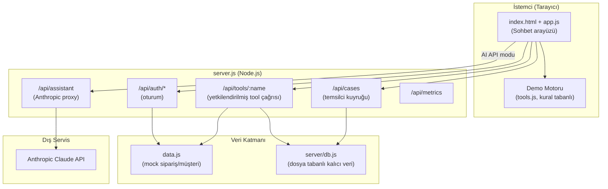
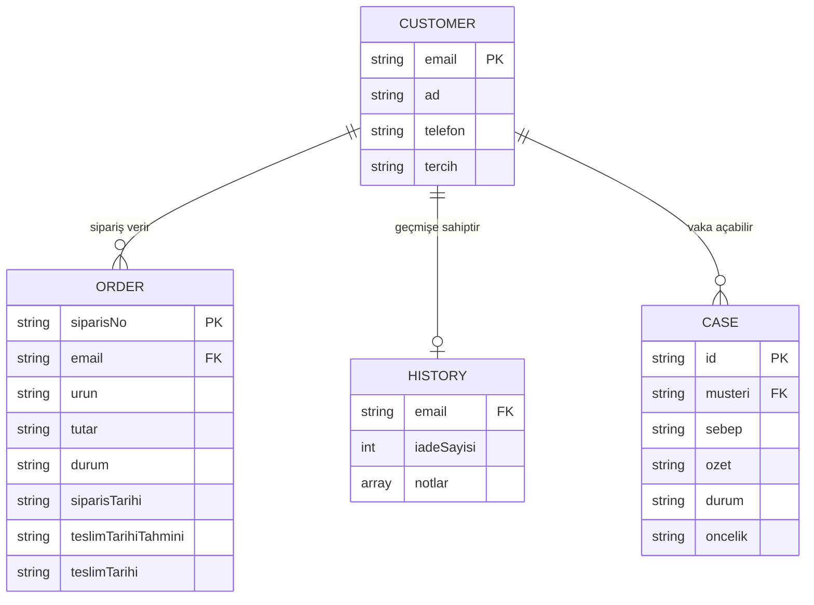

# DEPOM Müşteri Destek Agent — Bitirme Projesi Raporu (Taslak)

> Bu belge, projeyi bir üniversite bitirme projesi teslimine hazırlamak için hazırlanmış bir **iskelettir**. Köşeli parantez `[...]` ile işaretlenen yerler öğrenci tarafından tamamlanmalıdır. Kaynakça bölümündeki akademik atıflar kasıtlı olarak boş bırakılmıştır; gerçek olmayan/uydurma kaynak eklenmemiştir — danışmanınızla birlikte gerçek literatür taraması yapılmalıdır.

## Kapak Bilgileri
- Proje Adı: DEPOM Müşteri Destek Agent
- Öğrenci: [Ad Soyad, Öğrenci No]
- Danışman: [Danışman Adı, Unvanı]
- Bölüm / Üniversite: [Bölüm Adı, Üniversite Adı]
- Teslim Tarihi: [Tarih]

## Özet

Bu projede, e-ticaret şirketlerinin müşteri destek süreçlerinde (sipariş sorgulama, kargo takibi, iade/değişim işlemleri) kullanılabilecek, büyük dil modeli (LLM) tabanlı **tool-calling** mimarisiyle çalışan bir müşteri destek agent'ı geliştirilmiştir. Sistem; kimlik doğrulama, işlem yetkilendirmesi, şüpheli/dolandırıcılık deseni tespiti ve insan temsilciye eskalasyon gibi gerçek dünya müşteri hizmetleri gereksinimlerini modellemektedir. Proje, API gerektirmeyen kural tabanlı bir "demo motoru" ile gerçek bir yapay zekâ servisine (Anthropic Claude) bağlanan "API modu" olmak üzere iki çalışma biçimi sunar. Ayrıca güvenli bir arka uç (oturum yönetimi, kalıcı veri katmanı, hız sınırlama, güvenlik başlıkları) ile üretime geçiş için gerekli mimari desenler gösterilmiştir.

**Anahtar Kelimeler:** [ör. yapay zekâ ajanları, tool-calling, müşteri destek otomasyonu, LLM, web güvenliği]

## İçindekiler
1. Giriş
2. Literatür Taraması / Benzer Sistemler
3. Sistem Tasarımı
4. Gerçekleştirim
5. Test ve Değerlendirme
6. Sonuç ve Gelecek Çalışmalar
7. Kaynakça

---

## 1. Giriş

### 1.1 Problem Tanımı
Geleneksel müşteri destek hatları; sipariş durumu sorgulama, kargo takibi, iade ve değişim gibi tekrarlayan, kural tabanlı işlemler için önemli miktarda insan kaynağı tüketmektedir. Bu işlemlerin bir kısmı otomatikleştirilebilir olsa da, kimlik doğrulama, dolandırıcılık riski ve müşteri memnuniyeti gibi hassasiyetler nedeniyle tam otomasyon riskli olabilir.

### 1.2 Amaç ve Kapsam
Bu projenin amacı; sipariş/kargo/iade/değişim işlemlerini bir yapay zekâ agent'ının güvenli, denetlenebilir ve geri döndürülemez işlemlerde kullanıcı onayı zorunlu kılan bir mimariyle yürütmesini sağlamaktır. Kapsam:
- [ ] Sipariş sorgulama ve kargo takibi
- [ ] İade ve ürün değişimi (süre/teslimat kontrollü)
- [ ] Kimlik doğrulama (sipariş no + e-posta/telefon eşleşmesi)
- [ ] Duygu/öncelik analizi ve insan temsilciye eskalasyon
- [ ] Güvenli arka uç: oturum yönetimi, hız sınırlama, audit log

Kapsam dışı bırakılanlar: gerçek ödeme/kargo entegrasyonları, çoklu dil destekli doğal dil anlama, çok kullanıcılı temsilci rol yönetimi ([Bilinen Sınırlar](../README.md#bilinen-sınırlar) bölümüne bakınız).

### 1.3 Katkı / Özgünlük
[Bu projenin var olan çözümlerden farkı nedir? Örn: "Tool-calling akışının hem API modunda hem API'siz demo motorunda tutarlı çalışması", "geri alınamaz işlemler için açık onay zorunluluğu", "sunucu tarafında oturumdan bağımsız e-posta güvenmeme (impersonation önleme)" gibi somut, savunulabilir maddeler yazınız.]

---

## 2. Literatür Taraması / Benzer Sistemler

> **Not:** Bu bölümdeki kaynaklar öğrenci tarafından gerçek akademik makaleler/kitaplar ile doldurulmalıdır. Aşağıda yalnızca araştırılması önerilen konu başlıkları verilmiştir.

- Büyük dil modellerinde "tool use / function calling" mimarisi
- Kural tabanlı (rule-based) ile LLM tabanlı diyalog sistemlerinin karşılaştırması
- Müşteri hizmetlerinde otomasyon ve insan-makine iş birliği (human-in-the-loop)
- E-ticaret dolandırıcılık tespiti ve risk skorlama yöntemleri
- Web uygulamalarında oturum yönetimi ve OWASP Top 10 güvenlik prensipleri

Piyasadaki benzer ticari sistemler (karşılaştırma tablosu önerilir): [ör. Zendesk AI, Intercom Fin, Salesforce Agentforce] — bu sistemlerle projenin mimari farklarını bir tabloda karşılaştırınız.

---

## 3. Sistem Tasarımı

### 3.1 Genel Mimari

### 3.2 Veri Modeli

### 3.3 Kullanım Senaryoları (Use Case)

| Aktör | Senaryo | Ön Koşul | Sonuç |
|---|---|---|---|
| Müşteri | Sipariş durumu sorgulama | Kimlik doğrulanmış | Sipariş kartı gösterilir |
| Müşteri | İade talebi başlatma | Teslim edilmiş, 14 gün içinde, onay verilmiş | İade kodu üretilir veya incelemeye alınır |
| Müşteri | Ürün değişimi talebi | Teslim edilmiş, süre içinde, onay verilmiş | Değişim kodu üretilir |
| Sistem | Şüpheli desen tespiti | Mükerrer iade / eşleşmeyen kimlik | Otomatik eskalasyon |
| Temsilci | Bekleyen vakaları görüntüleme/çözme | Oturum açık | Vaka durumu güncellenir |

### 3.4 Güvenlik Tasarımı
- Kimlik doğrulama: sipariş no + e-posta/telefon eşleşmesi ([server/tools.js](../server/tools.js))
- Oturum: HMAC-SHA256 imzalı, `HttpOnly`, `SameSite=Strict` çerez ([server/session.js](../server/session.js))
- Yetkilendirme: tool çağrılarında e-posta istemciden değil oturumdan alınır (impersonation önleme)
- Hız sınırlama: IP başına dakikada 30 istek ([server.js](../server.js))
- Güvenlik başlıkları: CSP, `X-Frame-Options`, `X-Content-Type-Options`
- Denetim (audit) kaydı: `audit-log.jsonl`, boyut tabanlı rotasyon

### 3.5 Ardışık Akış (Sequence) Diyagramı
Bkz. [README.md — Mimari akış](../README.md#mimari-akış)

---

## 4. Gerçekleştirim

### 4.1 Kullanılan Teknolojiler
| Katman | Teknoloji |
|---|---|
| İstemci | Vanilla HTML/CSS/JavaScript (framework yok) |
| Sunucu | Node.js (yerleşik `http` modülü, harici bağımlılık yok) |
| Yapay zekâ | Anthropic Claude API (tool-calling / function calling) |
| Veri | Dosya tabanlı JSON kalıcılık (`server/db.js`) |
| Test | Node.js yerleşik test çalıştırıcısı (`node:test`) |

[Bu tercihlerin gerekçesini kendi cümlelerinizle yazınız: ör. "harici framework bağımlılığı olmadan temel web güvenliği prensiplerini göstermek amaçlanmıştır".]

### 4.2 Öne Çıkan Algoritmalar / İş Kuralları
- **İade/değişim uygunluk kontrolü:** teslimat durumu + 14 günlük süre penceresi ([tools.js](../tools.js), [server/tools.js](../server/tools.js))
- **Risk skorlama:** geçmiş iade sayısı, teslim edilen/geciken sipariş oranına dayalı 0-100 arası skor (`riskSkoruHesapla`)
- **Şüpheli desen tespiti:** mükerrer iade eşiği (`SUPHELI_ESIK`), eşleşmeyen kimlik bilgisi, tekrarlayan hasar iddiası
- **Duygu/öncelik analizi:** anahtar kelime tabanlı sınıflandırma (`duyguAnalizEt`)

### 4.3 Dosya Yapısı
[README.md içindeki "Dosyalar" tablosunu buraya kopyalayıp kısa açıklamalarla genişletiniz.]

### 4.4 Ekran Görüntüleri
[Buraya uygulamanın çalışır hâlinden ekran görüntüleri ekleyiniz: sohbet ekranı, iade formu, temsilci paneli, koyu tema, mobil görünüm.]

---

## 5. Test ve Değerlendirme

### 5.1 Test Stratejisi
Proje iki seviyede test edilmiştir:
1. **Birim testleri** — `server/tools.test.js`, `server/session.test.js` (Node.js yerleşik test çalıştırıcısı)
2. **Senaryo bazlı manuel test** — arayüzdeki "Test senaryosu seç" menüsü ile uçtan uca akışlar

### 5.2 Birim Test Kapsamı

| Test dosyası | Kapsanan senaryo |
|---|---|
| `server/tools.test.js` | Doğru/yanlış kimlik doğrulama, başkasının siparişine erişim engeli, teslim edilmemiş siparişte iade reddi, süre içi iade onayı, mükerrer iade engeli, eskalasyon vaka oluşturma |
| `server/session.test.js` | Token imzalama/doğrulama, bozulmuş token reddi, süresi geçmiş token reddi, cookie ayrıştırma |

> **Yapılacak:** `npm test` komutunu kendi makinenizde çalıştırıp çıktısını (kaç test geçti/kaç başarısız) buraya ekleyiniz: `[X/X test başarılı]`.

### 5.3 Manuel Senaryo Test Planı

| # | Senaryo | Beklenen Sonuç | Durum |
|---|---|---|---|
| 1 | Başarılı kargo sorgulama | Kargo adımları ve tahmini teslimat gösterilir | [ ] |
| 2 | Teslim edilmemiş siparişte iade | İşlem reddedilir, gerekçe gösterilir | [ ] |
| 3 | Süresi geçmiş iade | 14 günlük politika sınırı nedeniyle reddedilir | [ ] |
| 4 | Ürün değişimi (hasarlı ürün) | Onay formu sonrası değişim kodu üretilir | [ ] |
| 5 | Şüpheli / çok sinirli müşteri | Otomatik eskalasyon, temsilci kuyruğuna düşer | [ ] |
| 6 | Aynı siparişe iki kez iade talebi | İkinci talep engellenir | [ ] |
| 7 | Birden fazla sipariş numarası içeren mesaj | Kullanıcıdan tek sipariş numarası istenir | [ ] |

### 5.4 Bilinen Sınırlar
Bkz. [README.md — Bilinen sınırlar](../README.md#bilinen-sınırlar). Bu bölümü tez savunmasında "gelecekte yapılabilecekler" olarak da sunabilirsiniz.

---

## 6. Sonuç ve Gelecek Çalışmalar

[Projenin ulaştığı sonucu 1-2 paragrafla özetleyiniz. Örnek taslak:]

Bu çalışmada, LLM tabanlı tool-calling mimarisini kullanan, güvenlik ve denetlenebilirlik odaklı bir müşteri destek agent'ı geliştirilmiştir. Sistem, hem API gerektirmeyen bir demo motoru hem de gerçek bir yapay zekâ servisiyle çalışabilen ikili bir mimariyle esneklik sağlamaktadır.

**Gelecek çalışmalar:**
- Mock veri yerine gerçek bir veritabanı (PostgreSQL/SQLite) entegrasyonu
- Demo motorunun çok dilli niyet tespiti ile genişletilmesi
- Gerçek kullanıcılarla kullanılabilirlik testi (usability study)
- Rol tabanlı temsilci yetkilendirmesi ve SLA takibi

---

## 7. Kaynakça

> Bu bölüm kasıtlı boş bırakılmıştır. Lütfen danışmanınızla birlikte gerçek, doğrulanabilir akademik/teknik kaynaklar (makale, kitap, resmi dokümantasyon) ekleyiniz. Örnek biçim (APA 7):
>
> Soyad, A. (Yıl). *Başlık*. Yayınevi/Dergi.

- [ ] [Kaynak 1]
- [ ] [Kaynak 2]
- [ ] [Kaynak 3]
